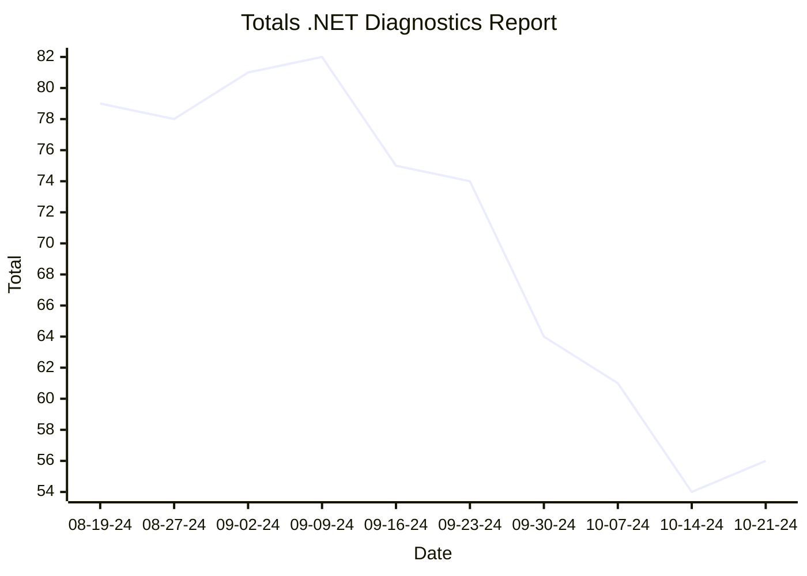
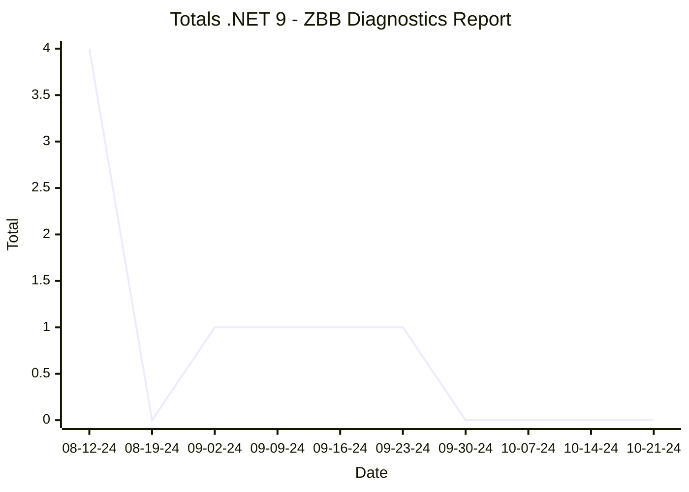

# Reports

[marker]: <> (Begin:diagnostics)

## .NET Diagnostics Report

- [.NET Diagnostics Report Full Report](./diagnostics-reports/dn-diag-issue-tracker-full.md)
- [.NET Diagnostics Report Latest Comparative Report (2024-10-21-06-19)](./diagnostics-reports/2024-10-21-06-19/dn-diag-issue-tracker-comp.md)
- [.NET Diagnostics Report CSV](./diagnostics-reports/dn-diag-issue-tracker-totals.csv)

[marker]: <> (End:diagnostics)
[marker]: <> (Begin:diagnostics-runtime-zbb9)

## .NET 9 - ZBB Diagnostics Report

- [.NET 9 - ZBB Diagnostics Report Full Report](./diagnostics-net9-zbb/dn-diag-net9-zbb-full.md)
- [.NET 9 - ZBB Diagnostics Report Latest Comparative Report (2024-10-21-04-17)](./diagnostics-net9-zbb/2024-10-21-04-17/dn-diag-net9-zbb-comp.md)
- [.NET 9 - ZBB Diagnostics Report CSV](./diagnostics-net9-zbb/dn-diag-net9-zbb-totals.csv)

[marker]: <> (End:diagnostics-runtime-zbb9)
